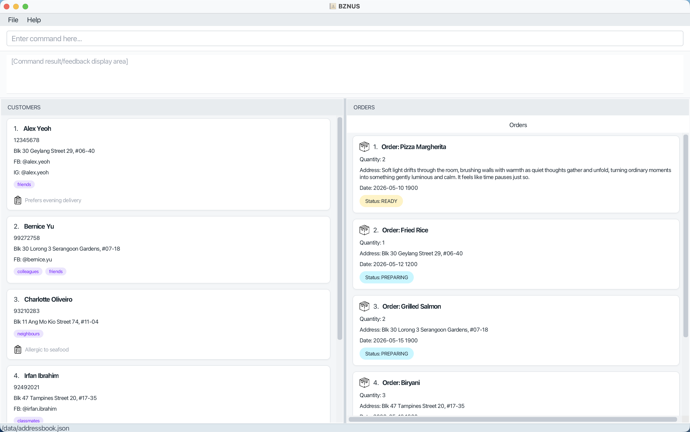
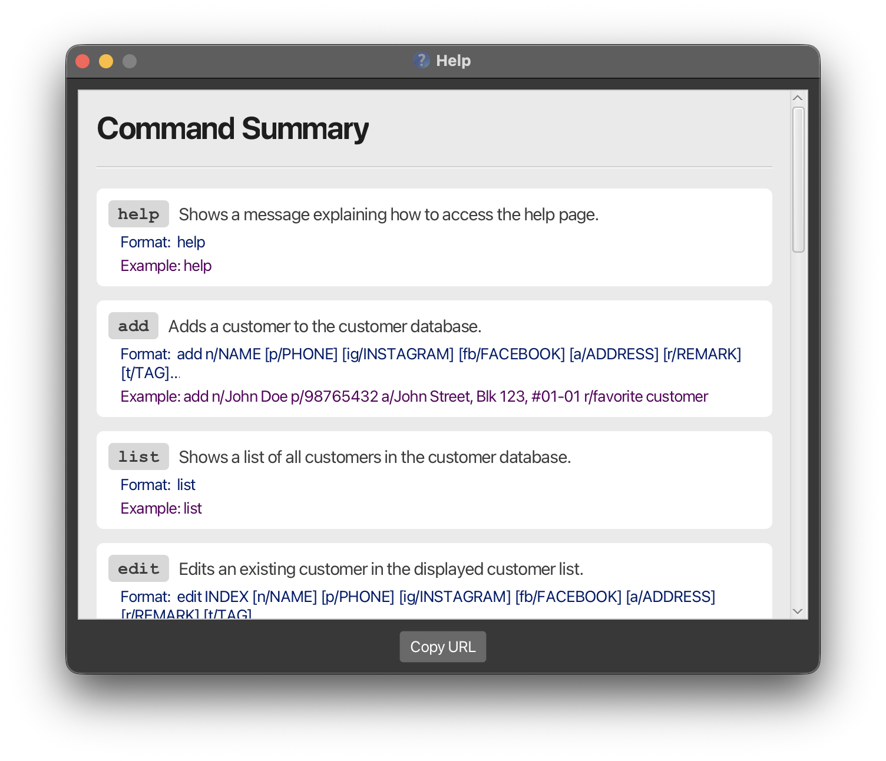
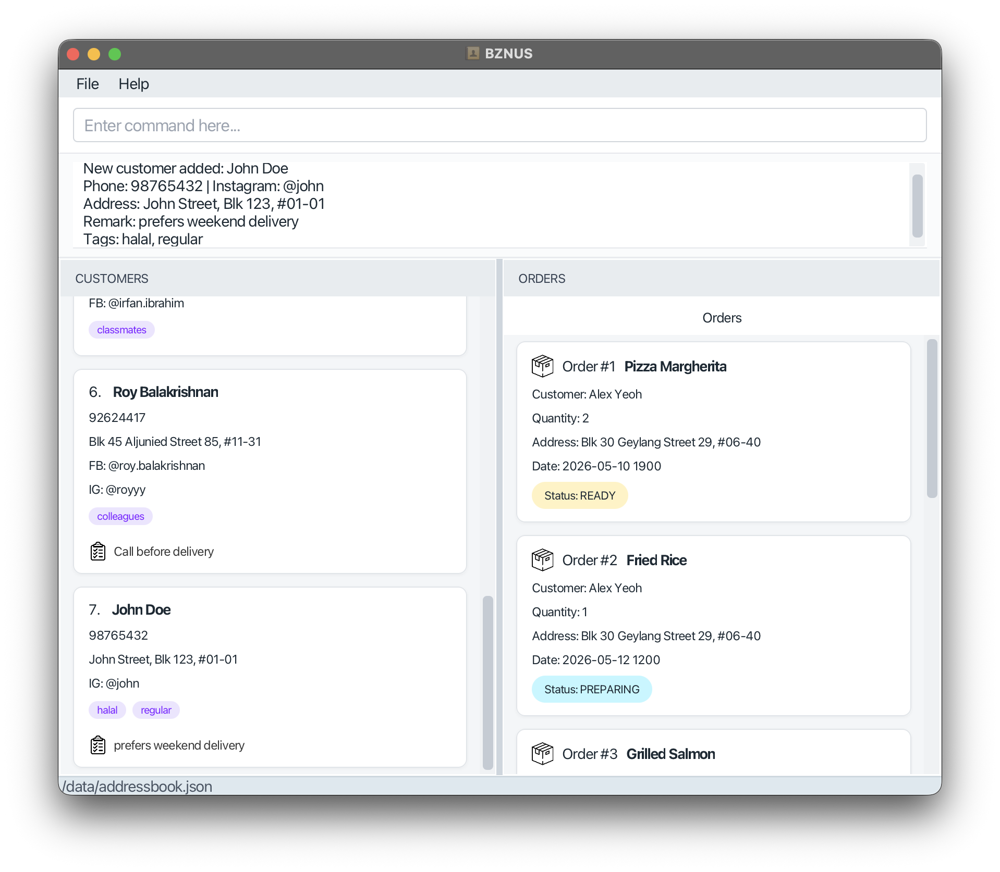
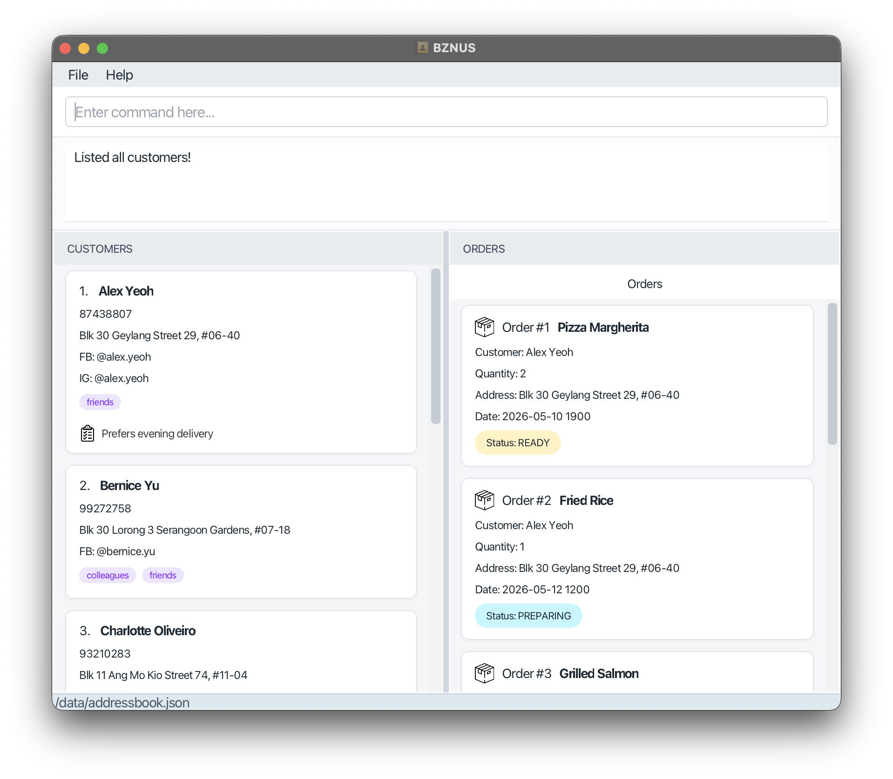
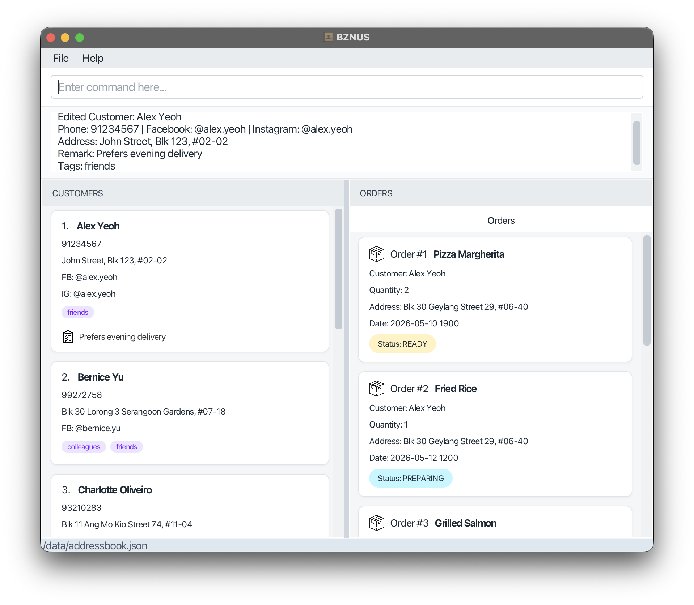
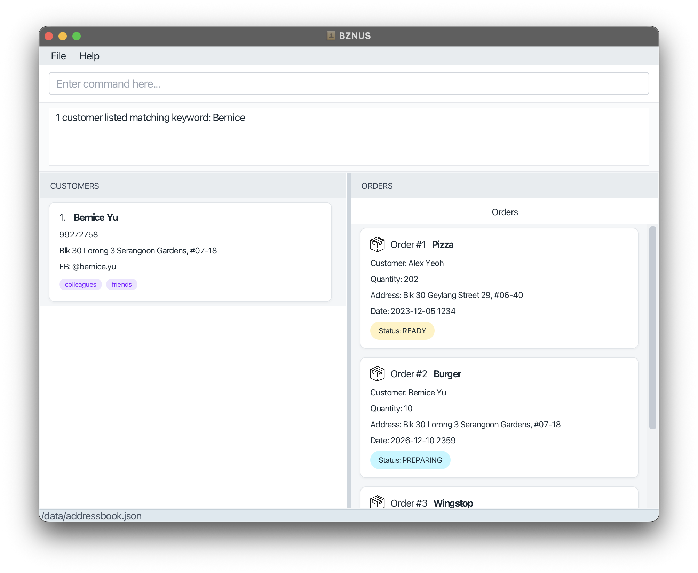
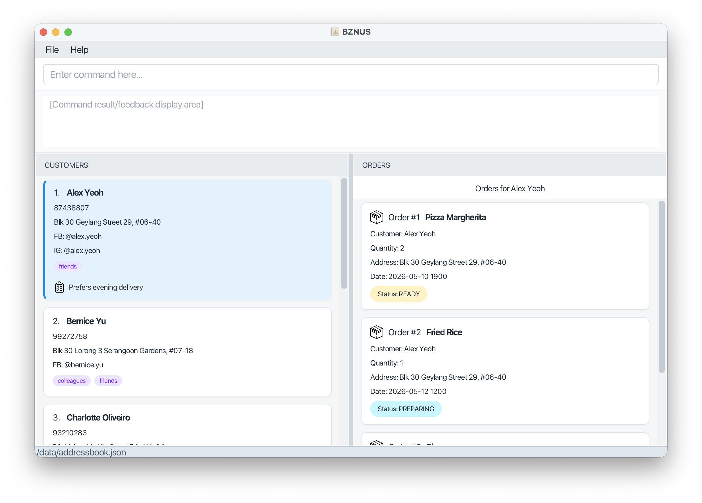

# BZNUS User Guide

BZNUS is a **one-stop desktop app for managing customer contacts, food orders and personalized customer preferences.** It provides a fast, reliable way for **home‑based food and beverage (F&B) business owners** to organise customer information and track orders in one place. Designed with a Command Line Interface (CLI) for speed and supported by a clean Graphical User Interface (GUI), BZNUS helps you complete customer‑management and order-tracking tasks more efficiently than traditional GUI‑only apps.

<!-- * Table of Contents -->
<page-nav-print />

--------------------------------------------------------------------------------------------------------------------

## Target Users and Assumptions

**BZNUS is built for small home-based F&B business owners who:**
- handle customer orders, order fulfillment, and personalised preferences across multiple platforms such as WhatsApp, Instagram, and Facebook
- want to consolidate scattered customer information into one organised system
- prefer fast, keyboard‑driven workflows and are comfortable with basic CLI usage 
- anticipate growing their customer base and need a system that scales with their business
- understand their business needs and can manage customer contact details responsibly

**Assumptions about users:**
- You have basic familiarity with CLI usage. 
- You understand your business operations and can maintain accurate customer information.

--------------------------------------------------------------------------------------------------------------------


## Table of Contents

1. [Quick start](#quick-start)
2. [Features](#features)
   - [Viewing Help: `help`](#viewing-help)
3. [Customer Commands](#customer-commands)
   - [Adding a Customer: `add`](#add)
   - [Listing All Customers: `list`](#list)
   - [Editing a Customer: `edit`](#edit)
   - [Finding a Customer: `find`](#find)
   - [Deleting a Customer: `delete`](#delete)
4. [Order Commands](#order-commands)
   - [Adding an Order: `order`](#order)
   - [Finding an Order: `find-o`](#find-o)
   - [Editing an Order: `edit-o`](#edit-o)
   - [Listing all Orders: `list-o`](#list-o)
   - [Deleting an Order: `delete-o`](#delete-o)
5. [Other Commands](#other-commands)
   - [Clearing All Entries: `clear`](#clear)
   - [Exiting the Program: `exit`](#exit)
6. [Data Storage](#data-storage)
   - [Saving the Data](#saving-data)
   - [Editing the Data File](#edit-data)
   - [Archiving Data Files `[coming in v2.0]`](#archive-data)
7. [FAQ](#faq)
8. [Known Issues](#known-issues)
9. [Command Summary](#command-summary)
   - [Customer Commands](#c-command)
   - [Order Commands](#o-command)
   - [Other Commands](#others)
10. [Troubleshooting](#troubleshooting)

--------------------------------------------------------------------------------------------------------------------

## <a id="quick-start"></a>Quick Start

1. Ensure you have Java `17` or above installed in your Computer.<br>
   **Mac users:** Ensure you have the precise JDK version prescribed [here](https://se-education.org/guides/tutorials/javaInstallationMac.html).

2. Download the latest `.jar` file from [here](https://github.com/AY2526S2-CS2103T-W09-3/tp/releases).

3. Copy the `.jar` file to the folder you want to use as the _home folder_ for BZNUS.

4. Open a command terminal, `cd` into the folder you put the jar file in, and use the `java -jar bznus.jar` command to run the application.<br>
   A GUI like this should appear in a few seconds. Note how the app contains some sample data.<br>\
   <br>
On startup, the order list is automatically filtered to display only orders with the statuses `PREPARING` or `READY`.

5. Type the command in the command box and press Enter to execute it. e.g. typing **`help`** and pressing Enter will open the help window.<br>
   Some example commands you can try:

   * `list` : Lists all customers.

   * `add n/John Doe p/98765432 a/John street, block 123, #01-01` : Adds a customer named `John Doe` to the customer database.

   * `order 1  i/Pizza  q/3  at/2026-06-02 1200 a/123 Jurong West St 42, #05-01 s/PREPARING` : Adds an order for 3 pizzas to the 1st customer in the current list.

   * `delete 3` : Deletes the 3rd customer shown in the current list.

   * `clear` : Shows a confirmation message before deleting all customers and their orders.

   * `exit` : Exits the app.

6. Refer to the [Features](#features) below for details of each command.

--------------------------------------------------------------------------------------------------------------------

## <a id="features"></a>Features

<box type="info" seamless>

**Notes about the command format:**<br>

* Words in `UPPER_CASE` are the parameters to be supplied by the user.<br>
  e.g. in `add n/NAME`, `NAME` is a parameter which can be used as `add n/John Doe`.

* Items in square brackets are optional.<br>
  e.g. `n/NAME [t/TAG]` can be used as `n/John Doe t/friend` or as `n/John Doe`.

* Items with `…`​ after them can be used multiple times including zero times.<br>
  e.g. `[t/TAG]…​` can be used as ` ` (i.e. 0 times), `t/friend`, `t/friend t/family` etc.

* Parameters can be in any order.<br>
  e.g. if the command specifies `n/NAME p/PHONE_NUMBER`, `p/PHONE_NUMBER n/NAME` is also acceptable.

* Extraneous parameters for commands that do not take in parameters (such as `help`, `list` and `exit`) will be ignored.<br>
  e.g. if the command specifies `help 123`, it will be interpreted as `help`.

* If you are using a PDF version of this document, be careful when copying and pasting commands that span multiple lines. Space characters surrounding line-breaks may be omitted when copied over to the application.
  * **Solution:** Type the command manually if pasting doesn't work.

</box>

### <a id="viewing-help"></a>Viewing Help : `help`

Shows a message explaining how to access the help page.


* The keyword `help` is case-insensitive

Format: `help`

--------------------------------------------------------------------------------------------------------------------

## <a id="customer-commands"></a>Customer Commands

<div class="section-spacing">

### <a id="add"></a>Adding a Customer : `add`

Adds a customer to the customer database.

Format: `add n/NAME [p/PHONE] [ig/INSTAGRAM] [fb/FACEBOOK] [a/ADDRESS] [r/REMARK] [t/TAG]…​`

* `NAME` is mandatory. It must be 1 to 100 characters long, start with an alphanumeric character, and contain only letters, numbers, spaces, apostrophes (`'`), slashes (`/`), and hyphens (`-`).
* `PHONE` must be 7 to 15 digits long and contain only numbers (e.g. 9123456 or 60123456789). No spaces, '+' sign, or other symbols are allowed.
* `INSTAGRAM` must be 1 to 30 characters long and contain only letters, numbers, underscores, and periods. It must not end with a period or have consecutive periods. No internal whitespaces allowed. The `@` prefix is optional.
* `FACEBOOK` must be 5 to 50 characters long and contain only letters, numbers, and periods. It must not have leading, trailing, or consecutive periods. No internal whitespaces allowed. The `@` prefix is optional.
* `ADDRESS` can be any non-blank string, but cannot exceed 200 characters.
* `REMARK` can be any non-blank string, but cannot exceed 500 characters.
* `TAG` must contain at least one letter or number, and may include spaces, underscores, and hyphens.

<box type="important" seamless>

**Note:** A customer must have **at least one** contact method: `p/PHONE`, `ig/INSTAGRAM`, or `fb/FACEBOOK`. The command will fail and show an error message if all contact methods are missing.

</box>

<box type="important" seamless>

**Duplicate Handling:** Customer names are unique (case-insensitive). For example, "John Doe" and "john doe" are considered the same person, and the app will reject the duplicate entry. Whitespace is also normalized: "   John      Doe" and "John Doe" are treated as the same customer name. Different customers may share contact details (e.g. phone, Facebook, or Instagram).

</box>

<box type="tip" seamless>

**Tip:** If you have two customers with the same name, use descriptors to differentiate them (e.g. "**John Doe (Clementi)**" and "**John Doe (Jurong)**"). A customer can also have any number of tags (including 0).

</box>

Examples:
1. `add n/John Doe p/98765432 ig/john a/John Street, Blk 123, #01-01 r/prefers weekend delivery t/halal t/regular`
2. `add n/Betsy Crowe t/friend fb/betsy.crowe a/Blk 456, Bedok North r/allergic to peanuts`
3. `add n/Tech Corp SG p/67778888 ig/techcorp.sg a/Tech Tower, Level 12 r/Invoicing required`

<box type="info" seamless>

**Expected output:**
On success, if all fields are provided, you will see the following message:
```
New customer added: NAME
Phone: PHONE | Facebook: FACEBOOK | Instagram: INSTAGRAM
Address: ADDRESS
Remark: REMARK
Tags: TAG1, TAG2, ...
```
Note that only the fields provided in the command will be shown in the output. For example, if you add a customer with only name and phone number, the output will only show the name, phone number and `Tags: -`.

**Sample output for Example 1:**

<br>
If the customer name is a duplicate or invalid input is provided, an error message will be shown. Please refer to the [Troubleshooting section](#troubleshooting) for more details.

</box>

</div>

<div class="section-spacing">

### <a id="list"></a>Listing All Customers : `list`

Shows a list of all customers in the customer database.

Format: `list`

<box type="info" seamless>

**Expected output:**
Displays all customers in the database, or shows "Customer list is empty." if the database is empty.



</box>

<box type="tip" seamless>

**Tip:** This is a useful command to reset filters on the customer list at any time.

</box>

<box type="tip" seamless>

**Tag display:** Very long tags may be truncated in the customer card for readability.
Hover over a truncated tag to view its full text in a tooltip.

</box>

</div>

<div class="section-spacing">

### <a id="edit"></a>Editing a Customer : `edit`

Edits an existing customer in the displayed customer list.

Format: `edit INDEX [n/NAME] [p/PHONE] [ig/INSTAGRAM] [fb/FACEBOOK] [a/ADDRESS] [r/REMARK] [t/TAG]…​`

* Edits the customer at the specified `INDEX`. The index refers to the index number shown in the displayed customer list. The index **must be a positive integer** 1, 2, 3, …​
* At least one field to edit must be provided.
* Existing values will be replaced by the values you provide.
* You can clear the following single-valued fields by providing the prefix without a value:
  * `p/` clears phone
  * `ig/` clears Instagram
  * `fb/` clears Facebook
  * `a/` clears address
  * `r/` clears remark
* `n/` (name) cannot be empty if present. Use `n/NEW_NAME` to change the name.
* After the edit is applied, the customer must still have at least one contact method (`p/`, `ig/`, or `fb/`). Otherwise, the edit is rejected.
* Tags are handled as a set:
  * t/TAG [t/MORE_TAGS]...` replaces all the customer's existing tags with the tag(s) provided. I.e. the addition of tags is not cumulative.
  * `t/` clears all existing tags.

<box type="warning" seamless>

**Important:** Updating a customer's address **does not** update the delivery address of their existing orders.

When an order is created **without specifying a delivery address**, the order takes a *snapshot* of the customer’s address at that moment. This value is stored permanently in the order.

- Editing the customer’s address later **will not** change created orders.
- To update an order’s delivery address, use `edit-o ORDER_INDEX a/NEW_ADDRESS`.

This behaviour ensures that historical orders remain accurate even if the customer moves or changes their address.

</box>

Examples:
1. `edit 1 p/91234567 a/John Street, Blk 123, #02-02` Edits the phone number and delivery address of the 1st customer to be `91234567` and `John Street, Blk 123, #02-02` respectively.
2. `edit 2 n/Betsy Crower t/` Edits the name of the 2nd customer to be `Betsy Crower` and clears all existing tags.
3. `edit 3 ig/ r/` Clears Instagram and remark for the 3rd customer.
4. `edit 4 p/ fb/ ig/ a/` Fails as this would remove all contact methods from the 4th customer.

<box type="info" seamless>

**Expected output:**
On success, if the edited customer has valid values for all fields, you will see the following message:
```
Edited Customer: NAME
Phone: PHONE | Facebook: FACEBOOK | Instagram: INSTAGRAM
Address: ADDRESS
Remark: REMARK
Tags: TAG1, TAG2, ...
```

Sample output for Example 1:


If the index is invalid, the customer name becomes a duplicate, or all contact methods would be cleared, an error message will be shown. Please refer to the [Troubleshooting section](#troubleshooting) for more details.

</box>

</div>

<div class="section-spacing">

### <a id="find"></a>Finding a Customer : `find`

Finds customers whose details match the given keywords. You can search across all fields or target a specific field using prefixes.

#### General Search
Format: `find KEYWORD`

* The search is case-insensitive. e.g. `hans` will match `Hans`.
* All fields are searched.
* Partial matches are supported e.g. `Han` will match `Hans`.

Examples:
* `find John` returns `john` and `John Doe`
* `find 99272758` returns `Bernice Yu` if her contact details contains these digits<br>\
  

<box type="important" seamless>

**Note:** All text after `find` is treated as a single keyword. For example, `find John Doe` searches for the phrase “John Doe” as one keyword, not two separate keywords.

</box>

#### Specific Field Search
Format: `find PREFIX/KEYWORD`

* The search is case-insensitive. e.g. `hans` will match `Hans`.
* Limits the search to a single specified field.
* Allows searching with multiple prefixes.

Available Prefixes:
* `n/NAME`
* `p/PHONE`
* `fb/FACEBOOK`
* `ig/INSTAGRAM`
* `a/ADDRESS`
* `r/REMARK`
* `t/TAG`

Examples:
* `find n/Alice` returns all customers whose name contains `Alice`.
* `find t/regular` returns all customers whose tags contain `regular`.
* `find n/Bob r/non-spicy` returns all customers whose name contains `Bob` and whose remark contains `non-spicy`.

</div>

### <a id="delete"></a>Deleting a Customer : `delete`

Deletes the specified customer from the customer database.

Format: `delete INDEX`

* Deletes the customer at the specified `INDEX`.
* The index refers to the index number shown in the displayed customer list.
* The index **must be a positive integer** 1, 2, 3, …​

<box type="important" seamless>

**Note:** All orders associated with the deleted customer will also be deleted.

</box>

Examples:
* `list` followed by `delete 2` deletes the 2nd customer in the customer database.
* `find Betsy` followed by `delete 1` deletes the 1st customer in the results of the `find` command.

---

## <a id="order-commands"></a>Order Commands

<div class="section-spacing">

### <a id="order"></a>Adding an Order : `order`

Adds a new order for a specific customer.

Format: `order INDEX i/ITEM_NAME q/QUANTITY at/DELIVERY_TIME [a/DELIVERY_ADDRESS] [s/STATUS]`

* Adds an order to the customer at the specified `INDEX`.
* The index refers to the index number shown in the displayed customer list.
* The index **must be a positive integer** 1, 2, 3, …​
* `ITEM_NAME` must **begin with a letter or a number**, contain only alphanumeric characters, spaces, and basic punctuation (e.g. '-', '&', apostrophes), and **cannot be blank**.
* `QUANTITY` **must be a positive integer** 1, 2, 3, …​.
* `DELIVERY_TIME` must be in `yyyy-mm-dd hhmm` format.\
If the time entered is not in the future, the order will still be added (to support recording of completed orders), but a warning will be shown.
* If `DELIVERY_ADDRESS` is not provided, the customer's stored address will be used.\
If the customer has no stored address, you will be prompted to enter a delivery address for the order.
* If `STATUS` is not provided, it defaults to `PREPARING`. Valid statuses: `PREPARING`, `READY`, `DELIVERED`, `CANCELLED`.

<box type="tip" seamless>

**Tip:** You can specify a/PICKUP for pickup orders.

</box>

**Examples:**
* `order 1 i/Pizza q/3 at/2026-06-02 1200`
* `order 2 i/Burger q/5 at/2026-07-15 1800 a/123 Jurong West St 42, #05-01`
* `order 3 i/Salad q/2 at/2026-08-10 1200 s/DELIVERED`

</div>

<div class="section-spacing">

### <a id="find-o"></a>Finding an Order : `find-o`

Search for different orders with 4 category options: item name, delivery address, customer, status

Format: `find-o Category-Type/Category-Keywords`

* Find the orders given the `Category-Keywords` from the `Category-Type`.
* The category keywords refer to the keyword used to look for orders.
* The category type refers to one of the 4 category options shown above.
* The category type **must be one of i/a/c/s**, which are respectively item, address, customer, status.
* Allows searching with multiple prefixes.

**Examples:**
* `find-o i/pizza` - Look for orders with item keyword "pizza"
* `find-o a/Ang Mo Kio` - Look for orders with delivery address "Ang Mo Kio"
* `find-o s/Delivered` - Look for orders that are already delivered
* * `find-o i/burger a/Kent Ridge` - Look for orders with item keyword "burger" and delivery address "Kent Ridge"

<box type="tip" seamless>

**Tip:** Besides using `c/`, you can also click on a customer entry in the list to view all orders of that customer.


</box>

</div>

<div class="section-spacing">

### <a id="edit-o"></a>Editing an Order : `edit-o`

Updates fields of an existing order. Any field you specify replaces the previous value; other fields stay unchanged.

Format: `edit-o ORDER_INDEX [i/ITEM_NAME] [q/QUANTITY] [at/DELIVERY_TIME] [a/DELIVERY_ADDRESS] [s/STATUS]`

* Edits the order at the specified `ORDER_INDEX`. The index refers to the order number shown in the **currently displayed order list**. The index **must be a positive integer**
* **At least one** of `i/`, `q/`, `at/`, `a/`, or `s/` must be provided. Omitting all of them is not allowed.
* The order **stays with the same customer**; you cannot reassign an order to another customer with this command.
* Field rules are the same as when using **`order`** (see **Adding an order** above):
  * `ITEM_NAME` must **begin with a letter or a number**, contain only alphanumeric characters, spaces, and basic punctuation (e.g. '-', '&', apostrophes), and **cannot be blank**.
  * `QUANTITY` **must be a positive integer** 1, 2, 3, …​.
  * `DELIVERY_TIME` must be in `yyyy-mm-dd hhmm` format.\
    Unlike when adding an order, no warning is shown if the updated delivery time is not in the future (as edits may involve updating completed orders).
  * If `DELIVERY_ADDRESS` is not provided, the customer's stored address will be used.
  * If `STATUS` is not provided, it defaults to `PREPARING`. Valid statuses: `PREPARING`, `READY`, `DELIVERED`, `CANCELLED`.
* After a successful edit, the full order list is shown again.

**Examples:**
* `edit-o 2 q/5` — changes the quantity of the 2nd order in the list to `5`.
* `edit-o 1 s/READY` — marks the first pizza order in the search results as ready.
* `edit-o 1 i/Salad at/2026-05-01 1800 a/Blk 123 Main Street` — updates item, delivery time, and address for the first order in the current list.

</div>

<div class="section-spacing">

### <a id="list-o"></a>Listing All Orders : `list-o`

Shows a list of all orders in the order database.

Format: `list-o`

<box type="tip" seamless>

**Tip:** This is a useful command to reset filters on the order list at any time.

</box>

</div>

### <a id="delete-o"></a>Deleting an Order : `delete-o`

Deletes the specific order from the order database.

Format: `delete-o ORDER_INDEX`

* Deletes the order at the specified `ORDER_INDEX`.
* The order index refers to the index number shown in the displayed order list.
* The index **must be a positive integer** 1, 2, 3, …​

**Examples:**
* `list-o` followed by `delete-o 3` deletes the 3rd order in the results of the `list-o` command.
* `find-o i/pizza` followed by `delete-o 1` deletes the 1st order in the results of the `find-o` command.

---

## <a id="other-commands"></a>Other Commands

<div class="section-spacing">

### <a id="clear"></a>Clearing All Entries : `clear`

Clears all customers and their orders from BZNUS.
To prevent accidental data loss, this command requires a specific confirmation keyword to execute.

Format:
* `clear` (shows confirmation message)
* `clear CONFIRM` (confirms and permanently deletes all data)

<box type="important" seamless>

**Note:** This action is irreversible. Once you run clear CONFIRM, all customer profiles, order histories, and related data will be permanently removed from the application.

</box>

</div>

<div class="section-spacing">

### <a id="exit"></a>Exiting the Program : `exit`

Exits the program.

Format: `exit`

</div>

---
## <a id="data-storage"></a>Data Storage

<div class="section-spacing">

### <a id="saving-data"></a>Saving the Data

BZNUS data is saved in the hard disk automatically after any command that changes the data. There is no need to save manually.

</div>

<div class="section-spacing">

### <a id="edit-data"></a>Editing the Data File

BZNUS data is saved automatically as a JSON file `[JAR file location]/data/addressbook.json`. Advanced users are welcome to edit this file directly, but please read the following notes carefully before doing so.

<box type="important" seamless>

**Important:** Only edit `addressbook.json` when BZNUS is **not running**.<br>
If you modify the file while the app is open, your changes will not be loaded into the current session. When you next run a command that saves data (e.g. `exit`), the app will overwrite the file and discard your manual changes.

</box>

<box type="warning" seamless>

**Caution:**
Certain edits (e.g. entering out-of-range values) can cause BZNUS to behave in unexpected ways. Only edit the data file if you are confident that you can update it correctly.<br>

</box>

<box type="warning" seamless>

**Disclaimer:** If you remove **all contact methods** from a customer in the file (e.g. delete phone, Facebook, and Instagram), the app **will not detect this error** when reopened. The customer will be loaded with no contact methods. It is your responsibility to ensure each customer in the data file has at least one contact method.

</box>

<box type="warning" seamless>

**Caution:**
If your changes to the data file makes its format invalid, BZNUS will start with empty customer and order lists at the next run. Hence, it is recommended to make a backup of the file before editing it.

**Save behavior:**
To help you understand how BZNUS handles corrupted data files:

- If `addressbook.json` is corrupted, BZNUS loads empty customer and orders lists on app startup but **does not overwrite the corrupted file** unless you explicitly save the current session.
- **Commands that save data:**
  - Any data‑modifying command (e.g. `add`, `clear`, `exit`) will save the current in-memory data and **overwrite** the corrupted file.
- **Actions that do _not_ save data:**  
  - Closing the window using the **X** button or pressing **`Ctrl+C`  in the terminal where BZNUS is running** does **not** save in-memory changes. The corrupted file remains unchanged, and BZNUS will load empty lists again on the next startup.
  
</box>

<box type="tip" seamless>

**Tip:** To fix corrupted data without losing everything you've stored:
1. Close BZNUS first by clicking the **X** button.
2. Edit `addressbook.json` manually.
3. Reopen BZNUS.

</box>

</div>

### <a id="archive-data"></a>Archiving Data Files `[coming in v2.0]`

_Details coming soon ..._

--------------------------------------------------------------------------------------------------------------------

## <a id="faq"></a>FAQ

**Q**: How do I transfer my data to another computer?<br>
**A**:
1. Install BZNUS on the new computer, run it once, then close the app.
2. On your old computer, open the folder containing `bznus.jar`, then go to `data/addressbook.json`.
3. Copy `addressbook.json` to the same location on the new computer (`[JAR file location]/data/`) and replace the existing data file.
4. Start BZNUS again. Your customers and orders should appear.

--------------------------------------------------------------------------------------------------------------------

## <a id="known-issues"></a>Known Issues

1. **When using multiple screens**, if you move the application to a secondary screen, and later switch to using only the primary screen, the GUI will open off-screen. The remedy is to delete the `preferences.json` file created by the application before running the application again.
2. **If you minimize the Help Window** and then run the `help` command (or use the `Help` menu, or the keyboard shortcut `F1`) again, the original Help Window will remain minimized, and no new Help Window will appear. The remedy is to manually restore the minimized Help Window.

--------------------------------------------------------------------------------------------------------------------

## <a id="command-summary"></a>Command Summary

<div class="section-spacing">

### <a id="c-command"></a>Customer Commands

| Action              | Format, Examples                                                                                                                                                                                                                  |
|---------------------|-----------------------------------------------------------------------------------------------------------------------------------------------------------------------------------------------------------------------------------|
| **Add Customer**    | `add n/NAME [p/PHONE_NUMBER] [fb/FACEBOOK] [ig/INSTAGRAM] [a/ADDRESS] [r/REMARK] [t/TAG]…​` <br> e.g., `add n/James Ho p/99996666 fb/james.Ho ig/james_Ho a/123, Clementi Rd, 1234665 r/extra spicy, no onion t/friend t/regular` |
| **Edit Customer**   | `edit INDEX [n/NAME] [p/PHONE_NUMBER] [fb/FACEBOOK] [ig/INSTAGRAM] [a/ADDRESS] [r/REMARK] [t/TAG]…​` <br> e.g., `edit 2 n/James Lee ig/jamesLee`                                                                                  |
| **Find Customer**   | `find KEYWORD [MORE_KEYWORDS]` <br> e.g., `find James Jake` <br> Or `find PREFIX/KEYWORD` <br> e.g., `find fb/james` or `find ig/james_ho`                                                                                        |
| **List Customers**  | `list`                                                                                                                                                                                                                            |
| **Delete Customer** | `delete INDEX` <br> e.g., `delete 3`                                                                                                                                                                                              |

</div>

<div class="section-spacing">

### <a id="o-command"></a>Order Commands

| Action           | Format, Examples                                                                                                                                                                      |
|------------------|---------------------------------------------------------------------------------------------------------------------------------------------------------------------------------------|
| **Add Order**    | `order INDEX i/ITEM_NAME q/QUANTITY at/DELIVERY_TIME [a/DELIVERY_ADDRESS] [s/STATUS]` <br> e.g., `order 3 i/Pizza q/3 at/2026-04-02 1200 a/123 Jurong West St 42, #05-01 s/PREPARING` |
| **Find Order**   | `find-o Category-Type/Category-Keywords` <br> e.g., `find-o i/pizza`                                                                                                                  |
| **Edit Order**   | `edit-o ORDER_INDEX [i/ITEM_NAME] [q/QUANTITY] [at/DELIVERY_TIME] [a/DELIVERY_ADDRESS] [s/STATUS]` <br> e.g., `edit-o 2 q/5 s/READY`                                                  |
| **List Orders**  | `list-o`                                                                                                                                                                              |
| **Delete Order** | `delete-o ORDER_INDEX` <br> e.g., `delete-o 1`                                                                                                                                        |

</div>

### <a id="others"></a>Other Commands

| Action    | Format, Examples |
|-----------|------------------|
| **Help**  | `help`           |
| **Clear** | `clear`          |
| **Exit**  | `exit`           |

--------------------------------------------------------------------------------------------------------------------

## Troubleshooting
This section provides quick fixes for common user-facing issues.

### Add Customer (`add`)

<panel header="Duplicate customer name" type="seamless">

**Warning shown:**  
"A customer with the same name already exists in the database."

**Why this happens:**  
Customer names are unique (case-insensitive, whitespace-normalized).

**What to do:**  
Use a different name that is not already in the customer database  
(e.g. include a descriptor such as `John Doe (Jurong)`).

</panel>

<panel header="No contact method provided" type="seamless">

**Warning shown:**  
"At least one contact method (phone, Facebook, or Instagram) must be provided."

**Why this happens:**  
At least one contact method is required.

**What to do:**  
Include at least one of `p/`, `ig/`, or `fb/`.

</panel>

<panel header="Invalid field format" type="seamless">

**Warning shown (any one of these):**
- "Name must be 1 to 100 characters, start with a letter or number, and contain only letters, numbers, spaces, apostrophes ('), slashes (/), and hyphens (-)."
- "Phone number must be 7 to 15 digits and contain only numbers (no spaces, '+' sign, or other symbols)."
- "Instagram username must be 1 to 30 characters, start with a letter or number, and contain only letters, numbers, underscores, and periods..."
- "Facebook username must be 5 to 50 characters, start with a letter or number, and contain only letters, numbers, and periods..."
- "Address cannot be blank and must not exceed 200 characters."
- "Remark cannot be blank and must not exceed 500 characters."
- "Tag must contain at least one letter or number, and may include spaces, underscores, and hyphens."

**Why this happens:**  
The input for a specific field does not meet the required field constraints.

**What to do:**  
Correct the specific field format and run the command again. Refer to the [Adding a customer](#add) section for detailed field requirements.

</panel>

<panel header="Invalid command format" type="seamless">

**Warning shown:**  
"Invalid command format! ..."

**Why this happens:**  
The command is missing required prefixes or has the wrong structure.

**What to do:**  
Ensure `add` includes `n/NAME` and at least one of `p/`, `ig/`, or `fb/`.  
Refer to the [Adding a customer](#add) section for the correct format.

</panel>

<panel header="Duplicate single-valued prefixes" type="seamless">

**Warning shown (example):**  
"Multiple values specified for the following single-valued field(s): n/"

**Why this happens:**  
Prefixes like `n/`, `p/`, `fb/`, `ig/`, `a/`, and `r/` can only appear once.

**What to do:**  
Keep to only one value for each single-valued prefix specified (`n/`, `p/`, `fb/`, `ig/`, `a/`, `r/`).

</panel>

<div style="height: 30px;"></div>

### Edit Customer (`edit`)

<panel header="Invalid index" type="seamless">

**Warning shown:**  
"The customer index provided is invalid. Please use an index from the displayed customer list."

**Why this happens:**  
The index does not exist in the currently displayed customer list.

**What to do:**
1. Run `list`
2. (Optional): Use `find KEYWORD` or `find PREFIX/KEYWORD` to narrow down the list if needed.
3. Retry the `edit` command with an index **within the displayed range** (e.g. `edit 1 ...` to edit the first customer in the currently displayed list).

</panel>

<panel header="Invalid command format" type="seamless">

**Warning shown:**  
"Invalid command format! ..."

**Why this happens:**  
- Case 1: The structure of the command is incorrect (e.g. you ran `edit INDEX` without specifying any fields to change).<br>  
- Case 2: The index entered is not a positive integer.

**What to do:**  
- Solution 1: Ensure you include a valid customer index and at least one field to edit (e.g., `n/`, `a/`, `p/`, `fb/`, `ig/`, `r/`). Refer to the [Editing a customer](#edit) section for the correct format.  
    Example: `edit 1 n/John Doe`<br>

- Solution 2: Use a positive integer index that is within the range of the currently displayed customer list.

</panel>

<panel header="Edit rejected after clearing at least one of `p/`, `ig/`, or `fb/`" type="seamless">

**Warning shown:**  
"The edited customer must still have at least one contact method (phone, Facebook, or Instagram)."

**Why this happens:**  
The edit would leave the customer with no contact methods.

**What to do:**  
Ensure at least one of `p/`, `ig/`, or `fb/` remains after editing.

</panel>

<panel header="Duplicate customer after editing name" type="seamless">

**Warning shown:**  
"A customer with the same name already exists in the database."

**Why this happens:**  
Customer names must be unique (case‑insensitive, whitespace‑normalised).

**What to do:**  
Use a different name that is not already in the customer database  
(e.g. include a descriptor such as `John Doe (Jurong)`).

</panel>

<panel header="Duplicate single‑valued prefixes" type="seamless">

**Warning shown (example):**  
"Multiple values specified for the following single-valued field(s): n/"

**Why this happens:**  
Prefixes such as `n/`, `p/`, `fb/`, `ig/`, `a/`, and `r/` can only appear once in the command.

**What to do:**  
Keep only one value for each single-valued prefix specified (`n/`, `p/`, `fb/`, `ig/`, `a/`, `r/`).

</panel>

<div style="height: 30px;"></div>

### List Customers (`list`)

<panel header="Customer list is empty after running `list`" type="seamless">

**Why this happens:**  
There are currently no customers stored in BZNUS, or the data file (`addressbook.json`) could not be loaded.

**What to do:**
- Add a new customer using `add`, or
- If you expected existing data, check the [Editing the data file](#edit-data) section for steps to recover from a corrupted `addressbook.json`.

</panel>

<div style="height: 30px;"></div>

